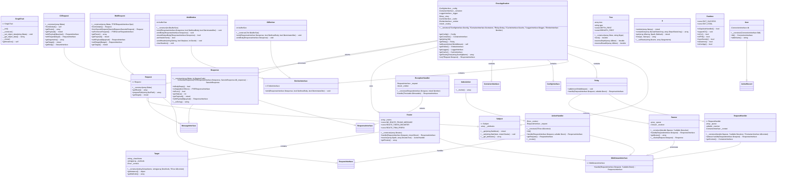

```mermaid
classDiagram
    class Subject {
        <<trait>> Subject
        -array __attributes
        +__get(string $attribute): mixed
        +__set(string $attribute, mixed $value): void
        +__get_attributes(): array
    }

    class SingleTrait {
        <<trait>> SingleTrait
        -__init()
        -__construct()
        -__set_object_data(string $data): void
        -__get_object_data(): string
        -__clone()
        +getInstance(): self
    }
    
    class RequestHandler {
        <<abstract>> RequestHandler
        -array _queue
        -callable _resolver
        -ContainerInterface _context
        +__construct(iterable $queue, ?callable $resolver, ?ContainerInterface &$context)
        +abstract handle(RequestInterface $request): ResponseInterface
        +getContext(): ContainerInterface
    }
    
    class MiddlewareInterface {
        <<interface>> MiddlewareInterface
        +handle(RequestInterface $request, ?callable $next): ResponseInterface
    }
    
    class EnsoApplication {
        -ConfigInterface _config
        -ContainerInterface _container
        -LoggerInterface _logger
        -Relay _relay
        -CacheInterface _cache
        -EmitterInterface _emitter
        -mixed _routing
        +__construct(?ConfigInterface $config, ?ContainerInterface $container, ?Relay $relay, ?CacheInterface $cache, ?LoggerInterface $logger, ?EmitterInterface $emitter)
        +getConfig(): Config
        +getContainer(): ContainerInterface
        +get(string $id)
        +getRelay(): Relay
        +addLayer(mixed $middleware): self
        +getEmitter(): EmitterInterface
        +getLogger(): LoggerInterface
        +getCache(): CacheInterface
        +getRoutingTree(string $configName): array
        +run(?Request $request): ResponseInterface
    }
    
    class Relay {
        +add(mixed $middleware): void
        +handle(RequestInterface $request, callable $next): ResponseInterface
    }
    
    class Runner {
        -array _queue
        -Closure _resolver
        +__construct(iterable $queue, ?callable $resolver)
        +handle(RequestInterface $request): ResponseInterface
        +getQueue(): array
        +__invoke(Request $request): Response
    }
    
    class Request {
        <<abstract>> Request
        +__construct(array $data)
        +getRoute(): array
        +preparePath(string $uriPath): array
        +getTarget(): mixed
    }
    
    class WebRequest {
        +__construct(array $data, ?PSRRequestInterface $psr)
        +fromGlobals(): Request
        +fromSwooleRequest(SwooleRequest $swooleRequest): Request
        +asPsrServerRequest(): PSRServerRequestInterface
        +getRoute(): array
        +getPayload(): mixed
        +withPayload($payload): RequestInterface
        +withTarget($target): RequestInterface
        +getTarget(): mixed
    }
    
    class CliRequest {
        +__construct(array $data)
        +fromGlobals(): self
        +getRoute(): array
        +getPayload(): mixed
        +withPayload($payload): RequestInterface
        +withTarget($target): RequestInterface
        +getArguments(): array
        +getTarget(): mixed
        +getBody(): StreamInterface
    }
    
    class Response {
        +__construct(array $data, int $statusCode)
        +toSwooleResponse(PSRResponseInterface $response, SwooleResponse &$_response): SwooleResponse
        +isBodyEmpty(): bool
        +collapse(bool $force): PSRResponseInterface
        +isError(): bool
        +getStatus(): int
        +getPayload(): mixed
        +withPayload($payload): ResponseInterface
        +__toString(): string
    }
    
    class Router {
        -array _routes
        +const NO_ROUTE_FOUND_MESSAGE
        +const ROUTE_TOKEN_DELIMITER
        +const ROUTE_TRIM_PREFIX
        +__construct(array $routes)
        +handle(RequestInterface $request, mixed $next): ResponseInterface
        +resolve(array $path, array $routesTree): ActionHandler
        +getRoutes(): array
    }
    
    class ActionHandler {
        -Enso _context
        -RequestInterface _request
        +__construct(?Enso &$context)
        +init()
        +handle(RequestInterface $request, callable $next): ResponseInterface
        +getRequest(): RequestInterface
        +__invoke()
    }
    
    class Target {
        -string _className
        -string|array _methods
        -Enso _context
        +__construct(string $className, string|array $methods, ?Enso &$context)
        +getInstance(): object
        +getMethods(): array
    }
    
    class EmitterInterface {
        <<interface>> EmitterInterface
        +emit(ResponseInterface $response, bool $withoutBody, bool $terminateAfter): void
    }
    
    class CliEmitter {
        -int bufferSize
        +__construct(?int $bufferSize)
        +emit(ResponseInterface $response, bool $withoutBody, bool $terminateAfter): void
        -emitBody(ResponseInterface $response): void
    }
    
    class WebEmitter {
        -int bufferSize
        +__construct(int $bufferSize)
        +emit(ResponseInterface $response, bool $withoutBody, bool $terminateAfter): void
        -emitBody(ResponseInterface $response): void
        -shouldOutputBody(ResponseInterface $response): bool
        -areHeaderSent(): bool
        -sendHeader(string $string, bool $replace, int $code): void
        -clearHeaders(): void
    }
    
    class ExceptionHandler {
        -RequestInterface _request
        -mixed _emitter
        +__construct(RequestInterface $request, mixed $emitter)
        +handle(Throwable $throwable): ResponseInterface
    }
    
    class Tree {
        -array tree
        -string type
        +const DEPTH_FIRST
        +const BREADTH_FIRST
        +__construct(array $tree, string $type)
        +next(): iterable
        -traverseDepth(array &$tree): iterable
        -traverseBreadth(array &$tree): iterable
    }
    
    class A {
        +random(array $array): mixed
        +completion(array $actualStateArray, array $inputStateArray): array
        +get(array &$array, $path, $default): mixed
        +merge(...$arrays): array
        +__callStatic(string $name, array $arguments)
    }
    
    class Runtime {
        +const EXIT_SUCCESS
        +const EXIT_FATAL
        +isSapiAsIsHandled(): bool
        +supportC3(): void
        +isCLI(): bool
        +isFPM(): bool
        +haveSwoole(): bool
        +isDaemon(): bool
        +isGoridge(): bool
    }
    
    class IndexAction {
        +__invoke(): array
    }
    
    class User {
        -ConnectionInterface db
        +__construct(ConnectionInterface $db)
        +db(): ConnectionInterface
        +tableName(): string
    }
    
    %% Relationships
    EnsoApplication --|> Subject
    Relay --|> RequestHandler
    RequestHandler --|> MiddlewareInterface
    Request --|> RequestInterface
    Request --|> MessageInterface
    Request --|> Subject
    WebRequest --|> Request
    CliRequest --|> Request
    Response --|> ResponseInterface
    Response --|> MessageInterface
    CliEmitter --|> EmitterInterface
    WebEmitter --|> EmitterInterface
    Router --|> MiddlewareInterface
    ActionHandler --|> MiddlewareInterface
    IndexAction --|> ActionHandler
    User --|> ActiveRecord
    
    %% Composition/Aggregation
    EnsoApplication --o Relay : contains
    EnsoApplication --o EmitterInterface : contains
    EnsoApplication --o ConfigInterface : contains
    EnsoApplication --o ContainerInterface : contains
    Relay --o Runner : contains
    EnsoApplication --o Router : uses
    EnsoApplication --o Request : processes
    EnsoApplication --o Response : returns
    Router --o Target : contains
    ActionHandler --o RequestInterface : handles
    ExceptionHandler --o ResponseInterface : returns
    Runner --o MiddlewareInterface : processes
```
